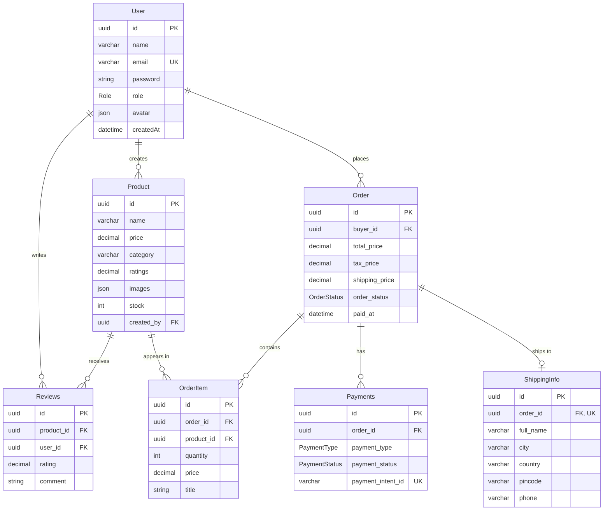

# ShopMate — Database ER Diagram

A clean, visual reference of the ShopMate database schema. Renders automatically
on GitHub/GitLab and in VS Code (with a Mermaid preview extension).

> Source of truth: [`server/prisma/schema.prisma`](../server/prisma/schema.prisma) (PostgreSQL).
> For the full annotated reference (column notes, enums, cascade rules), see
> [`server/prisma/ER_DIAGRAM.md`](../server/prisma/ER_DIAGRAM.md).

**Legend:** `PK` primary key · `FK` foreign key · `UK` unique ·
`||` one · `o{` zero-or-many · `o|` zero-or-one.
