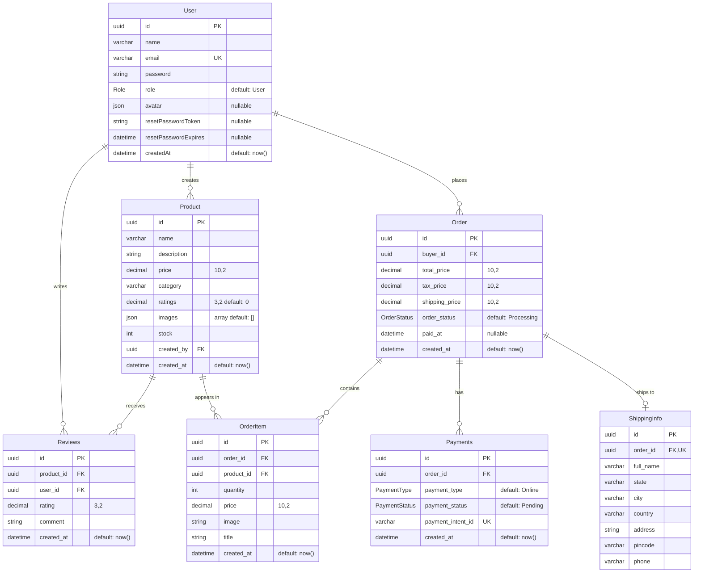

# ShopMate — Database ER Diagram

This document describes the complete database schema for the ShopMate e-commerce
application: all tables (entities), their columns, and the relationships between
them. The diagram below uses [Mermaid](https://mermaid.js.org/syntax/entityRelationshipDiagram.html),
which renders automatically on GitHub, GitLab, and in VS Code (with a Mermaid
preview extension).

> Source of truth: `prisma/schema.prisma` (PostgreSQL).

---

## Entity-Relationship Diagram

**Legend:** `PK` = primary key · `FK` = foreign key · `UK` = unique constraint ·
`||` = exactly one · `o{` = zero or many · `o|` = zero or one.

---

## Relationships

| From | To | Cardinality | FK column | On delete |
|------|----|-------------|-----------|-----------|
| User | Product | 1 → many | `Product.created_by` | Cascade |
| User | Reviews | 1 → many | `Reviews.user_id` | Cascade |
| User | Order | 1 → many | `Order.buyer_id` | Cascade |
| Product | Reviews | 1 → many | `Reviews.product_id` | Cascade |
| Product | OrderItem | 1 → many | `OrderItem.product_id` | Cascade |
| Order | Payments | 1 → many | `Payments.order_id` | Cascade |
| Order | OrderItem | 1 → many | `OrderItem.order_id` | Cascade |
| Order | ShippingInfo | 1 → 0..1 | `ShippingInfo.order_id` (unique) | Cascade |

All relations cascade on delete — removing a parent row removes its dependent
rows (e.g. deleting a `User` removes their products, reviews, and orders, which
in turn remove the orders' items, payments, and shipping info).

---

## Enums

| Enum | Values | Used by |
|------|--------|---------|
| `Role` | `User`, `Admin` | `User.role` (default `User`) |
| `OrderStatus` | `Processing`, `Shipped`, `Delivered`, `Cancelled` | `Order.order_status` (default `Processing`) |
| `PaymentType` | `Online`, `Offline` | `Payments.payment_type` (default `Online`) |
| `PaymentStatus` | `Paid`, `Pending`, `Failed` | `Payments.payment_status` (default `Pending`) |

---

## Notes

- **Primary keys** are UUIDs generated with `uuid()` and stored as PostgreSQL `@db.Uuid`.
- **`ShippingInfo` is effectively 1:1 with `Order`** — its `order_id` carries a
  unique constraint, so an order can have at most one shipping record.
- **`Payments.payment_intent_id`** is unique (maps to the Stripe payment intent),
  preventing duplicate payment records for the same intent.
- **`Product.images`** is a JSON array; **`User.avatar`** is a single JSON object
  (both typically store Cloudinary `{ public_id, url }` shape).
- Monetary fields use `Decimal(10,2)`; rating fields use `Decimal(3,2)`.
